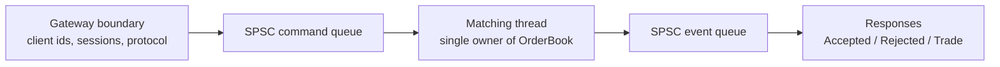

# llmes

**A low-latency C++ matching-engine lab that grew from a textbook order book into a measured trading-system core.**

`llmes` is not a generic TCP demo and not a toy data-structure benchmark. It is a phase-by-phase engineering project around one question:

> How far can a small, correct, single-owner C++ matching core be pushed when every optimization has to survive realistic HFT-style measurement?

The headline unit is **one submitted order-book operation (`op`)**. In the main benchmark, one op is one client request replayed into the book:

- limit order;
- cancel order;
- modify order;
- market order.

`ns/op`, `cycles/op`, and `instructions/op` are normalized by submitted requests, not by internal matches. A market order or crossing limit order may consume multiple resting maker orders, but it still counts as one op.

The main workload is `hft_macro`: a deterministic mixed order-entry stream built from a **Zero-Intelligence-style model** plus **HFT-tailored distributions** for near-best placement, short order lifetimes, cancel clustering, and non-flat depth.

Its target submitted-order distribution is:

| Request type | Target share |
|---|---:|
| Limit add | 45% |
| Cancel | 48% |
| Modify | 5% |
| Market | 2% |

After replay and scenario classification, the effective measured buckets can differ slightly, for example resting adds land around the high-40% range in the repaired macro workload. Setup, random generation, cancel-target selection, and handle resolution happen outside the timed window; the measured path is the prepared `RunOp()` replay through the matching engine.

The current answer:

- **15.63 ns/op** on the final HFT macro benchmark.
- **63.99M order-book ops/s** on Hetzner CCX23.
- **94.81 instructions/op** after LTO.
- **4.35 ns/message** for the standalone SPSC transport primitive.
- Full experiment history, including rejected ideas, is preserved in [`PROJECT_HISTORY.md`](PROJECT_HISTORY.md).

---

## Why This Project Is Interesting

Most matching-engine examples stop at correctness. This one went further:

- started from `std::map` + `std::list`;
- removed per-order allocation from the hot path;
- made cancel/modify O(1);
- moved arbitrary client-order-id lookup out of the matching core;
- replaced ordered price lookup with direct-addressed price levels;
- added bitmap-based next-best-price discovery;
- validated Linux isolation, perf sampling, per-scenario attribution, and LTO;
- then moved outward into SPSC transport for gateway/matching-thread integration.

The important part is not just the final number. The important part is the discipline:

> if a change reduced cache misses but increased total instructions and latency, it was rejected.

That happened repeatedly: custom hash tables, ChunkPool, PMR maps, eager ghost clearing, prefetch, PGO, and monotonic-counter SPSC variants all lost to measurement.

---

## Current Highlights

### Matching Core

| Result | Value |
|---|---:|
| Average latency | **15.630 ns/op** |
| Throughput | **63.99M ops/s** |
| Cycles/op | **57.25** |
| Instructions/op | **94.81** |
| Branches/op | **17.07** |

Final matching-core artifact:

```text
server_results/hft_macro/pgo_compare/pgo_compare_20260614_113205/
```

### SPSC Queue

| Variant | Latency | Throughput |
|---|---:|---:|
| Mutex baseline | 98.3 ns/msg | 10.2 Mmsg/s |
| Atomic + padding + acquire/release | 7.51 ns/msg | 133 Mmsg/s |
| **Atomic + opponent-index cache** | **4.35 ns/msg** | **230 Mmsg/s** |

SPSC report:

```text
report/spsc_cloud_benchmark_20260617.md
```

---

## Architecture Snapshot



Inside the matching core:

```text
OrderBook
|-- ArraySideBook<Bid>
|   |-- 4096 direct-addressed PriceLevel slots
|   `-- two-level OccupancyTree
|-- ArraySideBook<Ask>
|   |-- 4096 direct-addressed PriceLevel slots
|   `-- two-level OccupancyTree
`-- OrderPool
    `-- fixed vector + O(1) OrderHandle resolution
```

Core idea:

- the gateway owns `client_order_id -> OrderHandle`;
- the matching core receives handles, not arbitrary external ids;
- each side book resolves prices by array offset;
- the occupancy tree finds next best price without scanning;
- order queues are intrusive FIFO lists backed by a fixed pool.

---

## Performance Journey

This is the compressed story. The full version lives in [`PROJECT_HISTORY.md`](PROJECT_HISTORY.md).

| Milestone | Latency | Throughput | What changed |
|---|---:|---:|---|
| Phase 1 | 2170 ns/op | 0.47M ops/s | `std::map` + `std::list`, O(N) cancel |
| Phase 2b | 48.3 ns/op | 20.7M ops/s | O(1) cancel index |
| Phase 2e | 39.8 ns/op | 25.2M ops/s | Swiss-table hash map |
| Phase 6a | 29.3 ns/op | 34.1M ops/s | gateway-owned identity, direct handles |
| Phase 7c | 19.3 ns/op | 51.7M ops/s | hot ring, level pool, targeted inlining |
| Phase 8b | 17.2 ns/op | 58.1M ops/s | unified array side book |
| Phase 11 | **15.63 ns/op** | **63.99M ops/s** | LTO and core freeze |

Phase 12 starts the next layer: SPSC transport, then binary order-entry protocol and gateway integration.

---

## Benchmark Philosophy

`hft_macro` is the release gate, not a single-function microbenchmark. It keeps a live order book warm, prepares a realistic mixed operation list, and measures replay through the engine.

The project uses three levels of measurement:

| Tool | Purpose |
|---|---|
| `bench_hft_macro` | final throughput, latency, and hardware-counter gate |
| window-isolated `perf record` | production-path hotspot discovery |
| per-scenario collector | diagnostic CSVs for add/cancel tails |

The main benchmark is a deterministic Zero-Intelligence-style stream with HFT-tailored distributions:

- 45% limit add;
- 48% cancel;
- 5% modify;
- 2% market;
- near-best locality;
- short order lifetime;
- cancel clustering;
- non-flat depth.

Setup, random generation, cancel-target selection, and handle resolution happen outside the timed window. The timed path measures `RunOp()` replay over the prepared operation list, not the benchmark scaffolding.

---

## What's In The Repository

```text
core/matching_core/     matching engine and order book
core/SPSC/              SPSC ring-buffer implementations and standalone test
benchmark/              HFT macro benchmark, scenario collector, scripts
report/                 phase reports and benchmark analysis
server_results/         remote benchmark artifacts
PROJECT_HISTORY.md      complete experiment log
```

Important reports:

- [`PROJECT_HISTORY.md`](PROJECT_HISTORY.md) - full chronological project log
- [`report/phase11_lto_pgo_results.md`](report/phase11_lto_pgo_results.md) - final matching-core compiler results
- [`report/spsc_cloud_benchmark_20260617.md`](report/spsc_cloud_benchmark_20260617.md) - SPSC queue benchmark
- [`report/phase8_array_side_book_results.md`](report/phase8_array_side_book_results.md) - array side book results
- [`report/phase9_per_scenario_benchmark.md`](report/phase9_per_scenario_benchmark.md) - per-scenario and Linux isolation campaign

---

## Build

```bash
cmake -S . -B build \
  -DCMAKE_BUILD_TYPE=Release \
  -DLLMES_BUILD_TESTS=ON \
  -DLLMES_BUILD_BENCHMARKS=ON

cmake --build build -j$(nproc)
ctest --test-dir build --output-on-failure
```

LTO build:

```bash
cmake -S . -B build-lto \
  -DCMAKE_BUILD_TYPE=Release \
  -DCMAKE_INTERPROCEDURAL_OPTIMIZATION=ON \
  -DLLMES_BUILD_TESTS=ON \
  -DLLMES_BUILD_BENCHMARKS=ON

cmake --build build-lto -j$(nproc)
```

Standalone SPSC benchmark:

```bash
cd core/SPSC
g++ -O3 -std=c++20 -pthread test.cpp -o test
./test all 50000000
```

---

## Run Benchmarks

Local HFT macro benchmark:

```bash
bash benchmark/scripts/local/benchmarks.sh
```

Window-isolated perf record:

```bash
ENABLE_LTO=1 EVENTS=cycles:u FREQ=2000 USE_CHRT_FIFO=0 \
  bash benchmark/scripts/local/hft_macro_perf_record.sh
```

Per-scenario attribution:

```bash
ENABLE_LTO=1 bash benchmark/scripts/local/hft_macro_scenarios.sh
```

Full script index:

```text
benchmark/scripts/README.md
```

---

## Current Status

Done:

- matching core optimization track;
- direct-addressed array side book;
- handle-based cancel/modify API;
- HFT macro benchmark and perf workflow;
- SPSC queue study and recommended queue variant.

Next:

- fixed-size binary order-entry protocol;
- nonblocking TCP server with `epoll`;
- per-session input/output buffers;
- sequence checking and backpressure;
- gateway-side `client_order_id -> OrderHandle`;
- SPSC integration between gateway and matching thread.

Not production-complete yet:

- no network gateway is wired in;
- SPSC queue is standalone;
- no persistence/recovery;
- no risk layer;
- `OrderHandle` is still a raw pool index, not a generation-protected production token.

---

## The Short Version

`llmes` is a measured walk from a simple correct order book to a serious low-latency matching core, with the evidence left in the repo.

It is less a pile of clever tricks than a record of engineering judgment:

> measure the real path, delete the beautiful idea if the counters disagree, keep moving toward the system boundary.
