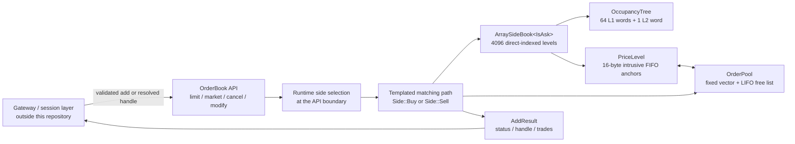

# llmes - Low-Latency Matching & Execution Simulator

`llmes` is a C++20 central limit order book built as a measured, phase-by-phase latency engineering project. It starts from a conventional `std::map` + `std::list` implementation and follows the evidence all the way to a handle-addressed, pool-backed, direct-indexed matching core.

The project is as much about **how to optimize a matching engine correctly** as it is about the final implementation: every major design change has a benchmark artifact, rejected experiments are retained, and intrusive measurements are separated from the release performance gate.

## Headline Results

Final Phase 11 result on the HFT macro workload:

| Metric | Baseline Release | Release + LTO | Change |
|---|---:|---:|---:|
| Average latency | 17.589 ns/op | **15.630 ns/op** | **-11.1%** |
| Throughput | 56.86 Mops/s | **63.99 Mops/s** | **+12.5%** |
| Cycles/op | 64.62 | **57.25** | **-11.4%** |
| Instructions/op | 127.67 | **94.81** | **-25.7%** |
| Branches/op | 25.06 | **17.07** | **-31.9%** |
| Text size | 95,810 B | **83,491 B** | **-12.9%** |

LTO beat the baseline on **all 50 paired validation seeds**. PGO and LTO+PGO were tested and rejected because neither beat LTO alone.

Across the full project history, the headline macro path moved from roughly **2170 ns/op in Phase 1 to 15.63 ns/op in Phase 11**. That is about a **139x reduction in average operation latency**. The comparison spans API and benchmark-contract improvements as well as data-structure work, so individual phase gains should be read from their paired experiments rather than treated as one perfectly controlled A/B test.

Primary final artifact: [`server_results/hft_macro/pgo_compare/pgo_compare_20260614_113205/`](server_results/hft_macro/pgo_compare/pgo_compare_20260614_113205/)

## What This Project Demonstrates

- **O(1) cancellation without a matching-core hash table.** External order identity is resolved at the gateway boundary; the core cancels and modifies by direct pool handle.
- **Direct-addressed price levels.** Each side uses 4096 indexed `PriceLevel` objects rather than a tree or a hot/cold hybrid.
- **Constant-height next-best lookup.** A two-level 64-bit occupancy tree finds the next active bid or ask without a linear price scan.
- **Allocation-free resting-order storage.** A fixed-capacity order pool and intrusive FIFO remove per-order `new`/`delete` from the hot path.
- **Compile-time side specialization.** Bid/ask traversal and crossing rules are templated; runtime side selection is confined to the public API layer.
- **Production-shaped performance measurement.** The primary benchmark uses one timing window around a large pre-generated operation batch, plus hardware counters and window-isolated `perf record`.
- **Negative results are first-class results.** Custom hash tables, ChunkPool, PMR maps, eager ghost clearing, manual prefetch, aggressive Linux isolation, and PGO were all measured and rejected where the data did not support them.

## Current Scope

The matching-engine and order-book optimization track is now considered complete for this project stage.

Implemented:

- limit, market, cancel, and modify operations;
- price-time priority within each price level;
- engine-issued `OrderHandle` values for O(1) cancel/modify resolution;
- direct-addressed bid and ask books;
- pooled intrusive order storage;
- trade collection through `AddResult`;
- deterministic HFT macro benchmark, PMC collection, per-scenario attribution, and isolated cloud runners;
- correctness tests and benchmark smoke tests.

Next system work:

- SPSC queues for command/event transport;
- single-owner matching-thread integration;
- trade/event sink design;
- network ingress and egress;
- journal, replay, and recovery;
- execution and risk components.

## Architecture

### Runtime Data Flow



The intended system boundary is important. `client_order_id` validation and any `client_order_id -> OrderHandle` mapping belong in the gateway. The matching core receives resolved handles for cancel and modify, keeping arbitrary-ID hashing off the single-threaded matching path.

### Core Components

| Component | Role | Hot-path property |
|---|---|---|
| `OrderBook` | Public matching API and taker-side dispatch | Matching internals are specialized by `Side` |
| `ArraySideBook<IsAsk>` | One side of the book | Price-to-level lookup is index arithmetic |
| `OccupancyTree` | Active-price summary | Next best is found with two levels of bit operations |
| `PriceLevel` | FIFO queue at one price | Two pointers; 16 bytes; intrusive append/erase |
| `OrderPool` | Resting-order ownership | Fixed vector, direct handle resolution, LIFO reuse |
| `OrderHandle` | Resting-order locator | `uint32_t` pool index; no hash probe |
| `AddResult` | Operation result and fills | Returns rest handle and chronological trades |

### Price-Level Lookup

Each side covers a fixed 4096-tick range. A price is converted directly to an array index:

```text
index = price - base_price
level = levels_[index]
```

The occupancy tree contains:

```text
L1: 64 words x 64 price bits = 4096 prices
L2: 1 word marking which L1 words are non-empty
```

When the best level is drained, the engine clears its bit, scans the L2 word for the next non-empty L1 word, then scans that L1 word for the next active price. Ask traversal searches upward; bid traversal searches downward. Both directions are selected at compile time.

### Order Lifecycle

Resting add:

1. Match against the opposite best levels while the limit crosses.
2. Acquire one slot from `OrderPool` if quantity remains.
3. Resolve the price by direct array index.
4. Set the occupancy bit and update the cached best index if needed.
5. Append the order to the level's intrusive FIFO.
6. Return the pool index as `OrderHandle`.

Cancel:

1. Resolve `OrderHandle` directly into `OrderPool`.
2. Unlink the order from its owning `PriceLevel` in O(1).
3. Return the slot to the LIFO free list.

Empty non-best levels are retired lazily. Eagerly clearing every level when its final order is cancelled was measured and rejected because it added work to the common mutation path.

### Complexity

| Operation | Complexity | Notes |
|---|---|---|
| Resting level lookup | O(1) | Direct price offset |
| Cancel | O(1) | Pool-index resolve + intrusive unlink |
| Modify | O(1) cancel + add | Implemented as remove then limit add |
| Next best price | O(H) | `H = 2`, fixed occupancy-tree height |
| Limit order | O(K + H) | `K` makers matched |
| Market order | O(K + L*H) | `L` price levels drained |

## Benchmark Design

### HFT Macro Workload

The release benchmark is a deterministic Zero-Intelligence-style event stream with HFT-shaped locality:

| Event | Target share |
|---|---:|
| Limit add | 45% |
| Cancel | 48% |
| Modify | 5% |
| Market | 2% |

The generator also models near-best placement, short order lifetimes, cancel clustering, and non-flat depth. Each run begins with 5000 seed adds and a 500,000-event untimed warmup.

All measured operations are pre-generated in `Setup()`. Cancel targets, parameters, tracking updates, and handles are resolved before timing. The book is then rebuilt deterministically so `RunOp()` contains only the matching operation being measured.

This prevents RNG, tracking maps, and benchmark planning from becoming part of the reported engine latency.

### Measurement Modes

| Tool | Measurement boundary | Use |
|---|---|---|
| `bench_hft_macro` latency | One clock window around the full batch | Primary average latency and throughput gate |
| `bench_hft_macro` PMC | One `perf_event_open` counter window around the batch | Cycles, instructions, branches, misses, CPI |
| Window-isolated `perf record` | Sampling enabled only during `RunOp()` | Function/instruction hotspot discovery |
| `bench_hft_macro_scenarios` | Timestamp pair around every selected call | Diagnostic distributions and attribution only |

The per-scenario collector records every call for:

- `add_rest_existing_level`;
- `add_rest_new_level`;
- `cancel_order`.

Market and crossing limit orders are replayed but not timed because one submitted operation can contain many matches. Modify is omitted because it is cancel plus add.

Per-call timing is intentionally **not** the release gate. `rdtsc`/`rdtscp`, fences, and `steady_clock` perturb the pipeline and quantize short operations into coarse cycle bands. It is useful for relative attribution, not for claiming absolute production p99.

### Test Environment for Final Results

| Field | Value |
|---|---|
| Server | Hetzner Cloud CCX23 |
| CPU | AMD EPYC Milan virtual CPU |
| Compiler | GCC 15.2.0 |
| Benchmark CPU | CPU 2 |
| NUMA node | Node 0 |
| Binding | `numactl --physcpubind=2 --membind=0` |
| Isolation | CPU/NUMA pinning, IRQ/workqueue migration, RT scheduling experiments, `nohz_full` |
| Final validation | 50 distinct paired seeds |
| Batch size | 100,000 operations |

## Performance Evolution

The table below is a navigation map, not a substitute for paired artifacts. Some rows come from different campaigns, and Phase 6 deliberately changes the engine boundary from arbitrary external IDs to resolved handles.

| Milestone | avg ns/op | Throughput | Main change |
|---|---:|---:|---|
| Phase 1 | 2170 | 0.47M ops/s | `std::list`, O(N) cancel |
| Phase 2a | 2137 | 0.47M ops/s | Pooled intrusive orders; cancel still O(N) |
| Phase 2b | 48.3 | 20.7M ops/s | Hash-indexed O(1) cancel |
| Phase 2e | 39.8 | 25.2M ops/s | Swiss-table cancel index |
| Phase 4a | 39.3 | 25.5M ops/s | `SideBook` abstraction |
| Phase 5 baseline | 34.4 | 29.1M ops/s | Corrected macro and production profiling baseline |
| Phase 6a | 29.3 | 34.1M ops/s | Gateway-owned identity, direct handles |
| Phase 7a | 23.2 | 43.1M ops/s | Hot ring + cold map |
| Phase 7b | 21.2 | 47.3M ops/s | Dedicated `PriceLevelPool` |
| Phase 7c | 19.3 | 51.7M ops/s | Profile-guided forced inlining |
| Phase 8b | 17.2 | 58.1M ops/s | Unified array side book |
| Phase 11 LTO | **15.63** | **63.99M ops/s** | Cross-TU optimization |

## Engineering Evolution: Why, How, Gain

### Phase 1 - Correctness-First Baseline

**Why:** Establish a simple reference implementation with clear price-time semantics before optimizing.

**How:** Store price levels in `std::map`; store orders at each level in `std::list`; find cancel and modify targets by scanning the book.

**Gain:** A trustworthy functional baseline and test oracle. Performance was intentionally poor: per-order allocation and O(N) cancellation produced roughly 2170 ns/op on the later unified macro campaign.

### Phase 2a - Pool Storage and Intrusive FIFO

**Why:** `std::list` allocates one node per order and scatters active data across the heap.

**How:** Replace list nodes with a preallocated `std::vector<Order>` pool and intrusive `prev`/`next` links owned by `PriceLevel`.

**Gain:** Legacy scenario throughput improved by 19-98%; cancel cache misses fell by 87-91%. The macro remained O(N)-cancel bound, so headline throughput barely changed.

### Phase 2b - O(1) Cancel Index

**Why:** Realistic order flow is cancel-heavy; scanning the whole book cannot scale.

**How:** Add `std::unordered_map<OrderId, Order*>` and enough parent metadata to unlink an order directly from its level.

**Gain:** Cancel-hit throughput rose from about 17K/s to 5.8M/s; cancel-miss throughput rose from 8.5K/s to 15.3M/s. The mixed workload jumped from thousands to millions of operations per second, despite hash maintenance slowing pure add/match paths.

### Phase 2c - Open Addressing with Tombstones

**Why:** Replace node-based `std::unordered_map` with a flatter table and reduce pointer chasing.

**How:** Implement a custom open-addressed cancel index with tombstone deletion.

**Gain:** Negative result. The macro regressed from 11.0M to 7.8M ops/s because tombstones lengthened probe chains and increased cache misses.

### Phase 2d - Robin Hood Hashing

**Why:** Remove tombstone accumulation and tighten probe-distance variance.

**How:** Use Robin Hood insertion with backward-shift deletion.

**Gain:** Negative result. Throughput remained about 7.8M ops/s; lower instruction count could not offset worse CPI and memory stalls.

### Phase 2e - Swiss Table

**Why:** Test a mature flat hash table against both custom designs and `std::unordered_map`.

**How:** Replace the cancel index with `absl::flat_hash_map`.

**Gain:** 11.9M ops/s and 84 ns/op: 52% faster than the custom tables and about 8% faster than Phase 2b. This became the final in-core hash-table design before the identity boundary was later changed entirely.

### Phase 3 - HFT Benchmark Redesign

**Why:** The early mixed benchmark was ad hoc and could reward designs that fail under realistic cancel locality and order lifetimes.

**How:** Introduce HFT micro scenarios and the 45/48/5/2 Zero-Intelligence macro stream. Move RNG, cancel-target selection, and operation planning outside the timed window.

**Gain:** A credible decision metric. It overturned the apparent promise of the custom hash tables and established `hft_macro` as the primary optimization gate.

### Phase 4a - Side-Book Abstraction

**Why:** Price-level storage could not evolve safely while matching logic directly depended on `std::map` details.

**How:** Wrap each side behind `empty()`, `best_price()`, `best_level()`, `get_or_create()`, and `erase_best()`.

**Gain:** Nearly performance-neutral at 39.3 ns/op, but it created the ownership boundary that made the Phase 7 and Phase 8 replacements possible.

### Phase 4b - ChunkPool Experiment

**Why:** Test whether grouping orders by price level improves locality over one global order pool.

**How:** Build chunk-owned level storage and sweep chunk sizes 16, 32, 64, 128, and 256.

**Gain:** Rejected. The best macro result was statistically close to the baseline, while add, cancel, modify, and market micro paths often regressed. Extra bookkeeping cost more than the locality improvement saved.

### Phase 4/5 - Benchmark Accounting Repair

**Why:** Early operation profiling showed an implausibly high `cancel_miss` share, indicating that the generated operation list had drifted from actual book state.

**How:** Add an untimed planning replay, update tracking from real `AddResult` and trade outcomes, then rebuild an identical book for the timed replay.

**Gain:** `cancel_miss` and `modify_miss` fell to zero in the valid workload. The repaired profile showed that resting adds contributed 52.98% of weighted time and cancel hits 35.44%. This prevented optimization of a benchmark artifact.

### Phase 5a - Intrusive Stage Instrumentation

**Why:** Attribute the dominant resting-add path to validation, pool acquisition, level lookup, FIFO append, and hash insertion.

**How:** Place `rdtsc` and `steady_clock` probes around each tiny stage.

**Gain:** Rejected measurement method. Probe latency was comparable to or larger than the code being measured, flattening unrelated stages into similar 140-cycle readings. The entire framework was removed.

### Phase 5b - Window-Isolated `perf record`

**Why:** Obtain production-path attribution without compiling timers into the hot loop, while excluding heavy setup and warmup work.

**How:** Use `perf record --control=fifo` and enable sampling only around the `RunOp()` batch.

**Gain:** The authoritative profile showed roughly half of macro cycles in the cancel-index hash table and 17.8% in `std::map` level lookup. This directly set the Phase 6 priority.

### Phase 6a - Gateway-Owned Identity and Engine Handles

**Why:** Under arbitrary external IDs, the in-core hash table consumed roughly half of macro cycles and could not be optimized away without changing the ownership contract.

**How:** Move duplicate-ID and client-ID resolution to the gateway boundary. Return a pool-index `OrderHandle` from resting adds; accept handles for cancel and modify; resolve them by one indexed pool access.

**Gain:** Average latency fell from 34.4 to 29.3 ns/op in the comparable campaign. `cancel_order` fell from about 29.8% to 9.1% of sampled cycles, and hash-table functions disappeared from the core profile.

### Phase 6b - PMR Price-Level Map

**Why:** After removing the cancel hash, `std::map::get_or_create()` became the largest remaining cost. Pooling map nodes looked like a low-risk way to remove allocator work.

**How:** Replace `std::map` with `std::pmr::map` backed by local pool and monotonic resources.

**Gain:** Rejected. Cache misses fell by about 21%, but instructions rose by 19% and latency regressed from 29.21 to 31.51 ns/op. This established an important rule for the rest of the project: lower cache misses are not useful if the structure executes substantially more work.

### Phase 7a - Hot Ring Buffer + Cold Map

**Why:** Near-best prices dominate the workload, but a pure fixed array was not yet acceptable because the benchmark price could drift. The goal was to bypass branchy ordered-map lookup on the common path without losing arbitrary-price correctness.

**How:** Add a 16-slot directed ring around the current best, track live slots with a compile-time-sized bit mask, and keep out-of-window prices in a cold `std::map`.

**Gain:** Against Phase 6a, latency improved by 19.9%, throughput by 24.9%, and branch misses fell by 32.2%. A 30-trial sweep showed ring sizes 16 and 32 were equivalent; 16 was retained for the smaller footprint.

### Phase 7b - PriceLevelPool

**Why:** Phase 7a still allocated each new price level with `make_unique`.

**How:** Add a dedicated contiguous `PriceLevelPool` with free-list acquire/release.

**Gain:** Latency improved from 23.18 to 21.16 ns/op, instructions fell by 13.4%, cache misses fell by 19.3%, and hot-path `malloc` disappeared.

### Phase 7c - Targeted Forced Inlining

**Why:** `perf` still showed tiny, high-frequency pool and handle helpers as real calls.

**How:** Move `acquire()`, `release()`, `resolve()`, and related short helpers into headers and apply `[[gnu::always_inline]]` where the profile justified it.

**Gain:** Latency improved by 9.5%, throughput by 10.5%, and instructions fell from 153.8 to 137.1 per operation. This was a targeted result, not a blanket claim that forced inlining is generally beneficial.

### Phase 8a - First Unified Array Side Book

**Why:** In Phase 7, hot lookup consumed only about 5.5% of cycles while `erase_best` and re-anchoring consumed another 4.37% and 4.65%. Coupling a ring and a map had become the cost.

**How:** Replace both structures with one fixed-range `ArraySideBook` and a hierarchical occupancy bitmap for next-best lookup.

**Gain:** Architectural validation, but nearly performance-neutral: 19.30 vs 19.57 ns/op. Branch and cache behavior improved, while generic ghost cleanup and occupancy code added about 21 instructions/op.

### Phase 8b - Fixed Occupancy Tree and Pure Read Paths

**Why:** The first array version performed cleanup during `empty()`, `best_price()`, and `best_level()`, and used generic loops/recursion despite a compile-time-known tree shape.

**How:** Remove ghost cleanup from pure reads; store bitmap levels in fixed `std::array`; explicitly unroll set, clear, and next/previous lookup.

**Gain:** Versus Phase 7c, latency fell by 10.7%, instructions by 5.2%, branch misses by 17.8%, and cache misses by 39.3%. Throughput reached about 58.1M ops/s.

### Phase 8c - Eager Empty-Level Retirement

**Why:** Try to eliminate lazy ghost cleanup by clearing occupancy as soon as cancel or modify empties a level.

**How:** Add owner-side/index metadata and perform immediate tree updates on common mutation paths.

**Gain:** Rejected. It added 9.5 instructions/op and regressed latency by 5.2%. Lazy retirement was restored.

### Phase 9 - Per-Scenario Attribution and Linux Isolation

**Why:** The macro average could not show which basic operation owned the tail, and cloud noise needed to be separated from engine behavior.

**How:** Record complete per-call CSV data for existing-level add, new-level add, and cancel. Add CPU/NUMA binding, SMT-aware CPU selection, IRQ/workqueue migration, governor controls, realtime experiments, watchdog suppression, and `nohz_full` boot isolation.

**Gain:** New-level add was isolated as the widest basic-operation distribution. System tuning reduced CPU2 softirqs from about 2254 to 219 and local timer interrupts from about 15590 to 4695, but ordinary p99 did not move. The system-noise hypothesis was therefore closed for this VM.

### Phase 10 - Tail Attribution and Cache Hypotheses

**Why:** Determine whether the new-level tail came from occupancy propagation, cold `PriceLevel` cache lines, or cold order-pool slots.

**How:** Classify each `OccupancyTree::set()` path, record PriceLevel and pool-slot reuse distance, test manual prefetch, shrink `PriceLevel` from 24 to 16 bytes, and reduce the range from 65536 prices/three bitmap levels to 4096 prices/two levels.

**Gain:** Bitmap propagation was measurably slower, but PriceLevel and slot reuse correlations were only 0.107 and 0.010. First touch was expensive but rare. The smaller array reduced instructions by 1.2% and cache misses by 4.5% but regressed macro latency by 0.8%. The smaller layout was retained for simplicity; the common p99/p999 cache hypothesis was rejected.

### Phase 11 - LTO, PGO, and Core Freeze

**Why:** Once the data structures stabilized, test whether the compiler could remove work across translation-unit boundaries without another invasive core rewrite.

**How:** Compare baseline, LTO, PGO, and LTO+PGO builds. Train PGO on 10 seeds and validate all modes on 50 separate paired seeds.

**Gain:** LTO delivered the final 15.630 ns/op result and removed 25.7% of instructions. PGO alone was 1.3% slower than baseline; LTO+PGO was 1.0% slower than LTO. PGO support was removed, LTO became the performance configuration, and the matching core was frozen.

## Lessons from Rejected Experiments

| Experiment | Expected benefit | Measured result | Decision |
|---|---|---|---|
| Tombstone open addressing | Fewer allocations than `unordered_map` | Probe chains and cache misses dominated | Reject |
| Robin Hood hashing | Better probe variance | Still slower than standard/Swiss tables | Reject |
| ChunkPool | Better same-level locality | Macro neutral; several micro paths slower | Reject |
| Intrusive per-stage timers | Fine-grained attribution | Probe overhead exceeded measured stages | Remove |
| PMR map nodes | Fewer map allocations | Fewer misses, 19% more instructions, 8% slower | Reject |
| Eager ghost clearing | Remove lazy cleanup | +9.5 instructions/op, 5.2% slower | Reject |
| Manual prefetch | Hide cold level access | No stable gain; cancel p999 sometimes worsened | Reject |
| Aggressive OS isolation | Remove p99 scheduler noise | Interrupts fell sharply; ordinary p99 stayed flat | Keep reproducibility controls, close hypothesis |
| PGO | Workload-specialized layout | Slower than baseline or LTO alone | Remove |

## Build and Test

Requirements:

- CMake 3.20 or newer;
- C++20 compiler;
- GCC 13+ or Clang 16+ recommended;
- Linux for hardware-counter and `perf` workflows.

```bash
cmake -S . -B build \
  -DCMAKE_BUILD_TYPE=Release \
  -DLLMES_BUILD_TESTS=ON \
  -DLLMES_BUILD_BENCHMARKS=ON

cmake --build build -j$(nproc)
ctest --test-dir build --output-on-failure
```

For an LTO build:

```bash
cmake -S . -B build-lto \
  -DCMAKE_BUILD_TYPE=Release \
  -DCMAKE_INTERPROCEDURAL_OPTIMIZATION=ON \
  -DLLMES_BUILD_TESTS=ON \
  -DLLMES_BUILD_BENCHMARKS=ON

cmake --build build-lto -j$(nproc)
```

## Running Benchmarks

Standard local macro campaign:

```bash
bash benchmark/scripts/local/benchmarks.sh
```

Example parameter override:

```bash
SCENARIOS=hft_macro \
METRICS=latency,pmc \
ORDERS=100000 \
LEVELS=100 \
BATCH_SIZES=100000 \
TRIALS=10 \
VERSION_TAG=experiment \
COMMIT_SHA=$(git rev-parse --short HEAD) \
  bash benchmark/scripts/local/benchmarks.sh
```

Per-scenario attribution:

```bash
ENABLE_LTO=1 bash benchmark/scripts/local/hft_macro_scenarios.sh
```

The generated CSV files can be summarized and plotted with the scripts under `benchmark/scripts/analysis/`; their accepted inputs and environment variables are documented in [`benchmark/scripts/README.md`](benchmark/scripts/README.md).

Window-isolated profiling:

```bash
ENABLE_LTO=1 EVENTS=cycles:u FREQ=2000 USE_CHRT_FIFO=0 \
  bash benchmark/scripts/local/hft_macro_perf_record.sh
```

Remote A/B comparison:

```bash
SERVER_IP=<server> \
REPO_URL=<git-url> \
  bash benchmark/scripts/remote/compare.sh
```

See [`benchmark/scripts/README.md`](benchmark/scripts/README.md) for the full local, remote, isolation, and analysis script index.

## Repository Layout

```text
llmes/
|-- core/matching_core/
|   |-- include/matching/
|   |   |-- order_book.hpp
|   |   |-- array_side_book.hpp
|   |   |-- occupancy_tree.hpp
|   |   |-- price_level.hpp
|   |   |-- order_pool.hpp
|   |   `-- types.hpp
|   |-- src/
|   `-- tests/
|-- benchmark/
|   |-- src/hft/
|   |-- scripts/
|   |   |-- local/
|   |   |-- remote/
|   |   |-- analysis/
|   |   `-- lib/
|   `-- tests/
|-- report/              # design records and phase reports
|-- server_results/      # remote benchmark artifacts
|-- PROJECT_HISTORY.md   # chronological experiment log
`-- CMakeLists.txt
```

Historical branches are retained for the major milestones, including `phase1-finale`, `phase2a` through `phase2e`, `phase4a`, `phase5-finale`, `phase6a`, `phase7a` through `phase7c`, `phase8a` through `phase8c`, `phase9`, and `phase10`.

## Reports and Evidence

| Topic | Report |
|---|---|
| Phase 1-2 allocator and cancel-index work | [`phase1_vs_phase2_report.md`](report/phase1_vs_phase2_report.md) |
| Hash-table comparison | [`phase2b_to_phase_2e_comparison.md`](report/phase2b_to_phase_2e_comparison.md) |
| HFT workload design | [`phase3_hft_benchmark_design.md`](report/phase3_hft_benchmark_design.md) |
| Price-level strategy | [`phase4_price_level_storage_strategy.md`](report/phase4_price_level_storage_strategy.md) |
| Production profiling | [`phase5_macro_profiling_plan.md`](report/phase5_macro_profiling_plan.md) |
| Handle-based engine boundary | [`phase6_engine_handle_refactor_plan.md`](report/phase6_engine_handle_refactor_plan.md) |
| Hot ring + cold map design | [`phase7_hot_ring_cold_map_design.md`](report/phase7_hot_ring_cold_map_design.md) |
| Phase 7 results | [`phase7_benchmark_results.md`](report/phase7_benchmark_results.md) |
| Fixed-array rationale | [`phase8_fixed_array_design.md`](report/phase8_fixed_array_design.md) |
| Phase 8 results | [`phase8_array_side_book_results.md`](report/phase8_array_side_book_results.md) |
| Scenario benchmark and Linux isolation | [`phase9_per_scenario_benchmark.md`](report/phase9_per_scenario_benchmark.md) |
| Tail attribution and cache tests | [`phase10_progress.md`](report/phase10_progress.md) |
| LTO/PGO and final core decision | [`phase11_lto_pgo_results.md`](report/phase11_lto_pgo_results.md) |
| Complete chronological record | [`PROJECT_HISTORY.md`](PROJECT_HISTORY.md) |

## Known Constraints

The final core is deliberately benchmark-focused rather than production-complete:

- `OrderHandle` is currently a raw pool index without a generation counter; stale-handle ABA protection belongs in a production handle format.
- The default side book covers 4096 prices and asserts that prices fall inside the configured range.
- Order-pool capacity is fixed at construction; exhaustion is asserted rather than surfaced as a recoverable result.
- Duplicate external IDs, cancel-before-add, malformed handles, and session policy are assumed to be validated by the gateway.
- `AddResult::trades` is still a `std::vector<Trade>`; the next architecture stage is expected to move event delivery to a preallocated SPSC pipeline.
- The engine is single-threaded and contains no network, persistence, recovery, or risk layer.
- The macro workload is synthetic. It is designed to expose HFT-like access patterns, not to claim fidelity to every venue or instrument.

These are explicit boundaries, not hidden production claims. The project currently answers a narrower question: **how far can a small, correct, single-owner C++ matching core be pushed when each structural decision is driven by measured workload evidence?**
